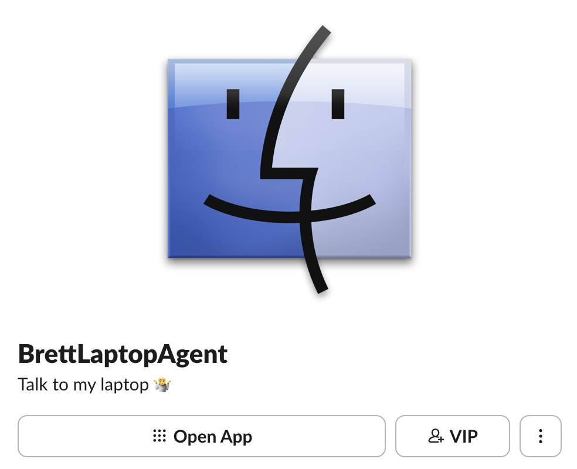

# SlackDeskBot

Your local coding agent, answering in Slack with context from your codebase. It uses your existing agent config and credentials and exposes only the tools you enable.

<p align="center">
    
</p>

| Deployment                | Backends          |
| ------------------------- | ----------------- |
| macOS (LaunchAgent + Hum) | Pi, Codex, Claude |
| Linux container (GHCR)    | Pi                |

Codex and Claude are macOS-only because they are confined with Seatbelt.

## Quick start

```sh
git clone https://github.com/brettinternet/slack-desk-bot.git
cd slack-desk-bot
mise install
mise exec task -- task init
```

Create the Slack app:

1. Create an app from [`slack-app-manifest.yaml`](slack-app-manifest.yaml) (rename it first if you like).
2. **Basic Information → App-Level Tokens**: create a token with `connections:write`.
3. Install the app. Reinstall after any manifest change.
4. Copy the bot token (`xoxb-…`) and app token (`xapp-…`).

Socket Mode means no public endpoint. Authenticate Pi (`pi`, `/login`, pick a model), then:

```sh
cp .env.example .env   # tokens, absolute SLACK_AGENT_CWD, SLACK_ALLOWED_USER_IDS
task doctor            # checks settings, tokens, paths, ports, Slack, backend
hum up                 # hum status | hum logs agent | hum down
```

All settings are in [`.env.example`](.env.example). Run `task doctor` after any change.

## Backends

### Pi (default)

```dotenv
SLACK_AGENT_BACKEND=pi
```

Model comes from the gitignored `.pi/settings.json` in this repo (other fields ignored), falling back to the Pi agent directory's default:

```json
{ "defaultProvider": "openrouter", "defaultModel": "anthropic/claude-opus-4.5" }
```

`models.json` and `auth.json` come from the Pi agent directory shown by `task doctor`. Its extensions, skills, and prompt templates are not loaded. Tools are limited by `SLACK_AGENT_MODE` and `SLACK_AGENT_COMMAND_MODE`, checked again on every call.

Pi-only features: reading thread history on demand, DMing people, schedules, watches, the GitHub PR tool, brokered commands, and MCP context.

### Codex

```sh
mise use -g codex@latest
export CODEX_HOME="$HOME/Library/Application Support/SlackDeskBot/codex"
mkdir -p "$CODEX_HOME" && codex login
```

```dotenv
SLACK_AGENT_BACKEND=codex
SLACK_AGENT_MODE=read-only          # read-write is unsupported
SLACK_CODEX_HOME=/Users/you/Library/Application Support/SlackDeskBot/codex
SLACK_CODEX_EXECUTABLE=/abs/codex   # only if codex isn't on the LaunchAgent PATH
```

Threads persist under `SLACK_CODEX_HOME`, so Slack and `slack-desk attach` resume across restarts.

### Claude

```sh
export CLAUDE_CONFIG_DIR="$HOME/Library/Application Support/SlackDeskBot/claude"
mkdir -p "$CLAUDE_CONFIG_DIR" && claude auth login
```

```dotenv
SLACK_AGENT_BACKEND=claude
# optional: SLACK_CLAUDE_HOME, SLACK_CLAUDE_EXECUTABLE
```

| Mode       | Tools                                          |
| ---------- | ---------------------------------------------- |
| read-only  | `Read`, `Glob`, `Grep`                         |
| read-write | adds `Edit`, `Write` (one active conversation) |

Runs `claude -p --output-format stream-json` with its own config dir, inherited settings ignored, and no permission prompts. Bash, web, and shell tools are denied. Sessions resume after the first successful reply.

### Comparison

|                       | Pi  | Codex | Claude |
| --------------------- | --- | ----- | ------ |
| Read-write mode       | Yes | No    | Yes    |
| Text attachments      | Yes | Yes   | Yes    |
| Image attachments     | Yes | No    | No     |
| Linux container       | Yes | No    | No     |
| MCP context, brokered | Yes | No    | No     |

## Using it in Slack

```text
@bot summarize this thread
laptop: check the failing test
!status
```

| Situation                             | Needs a mention?          |
| ------------------------------------- | ------------------------- |
| Channel, new conversation             | Yes (`@bot`)              |
| DM                                    | No                        |
| Bot thread, last inviter, within 24h  | No, for clear requests    |
| Answering the bot's question          | No, for the person asked  |
| Anyone else, or thread older than 24h | Yes (`@bot` or `laptop:`) |

Acknowledgements, side chatter, and messages addressed to others are ignored.

| Command              | Effect                                 |
| -------------------- | -------------------------------------- |
| `!help`              | Usage and commands                     |
| `!status`            | Model, context, cost, messages         |
| `!reset`             | New session (old transcript kept)      |
| `!cancel` / `cancel` | Cancel your request (any, if operator) |

**Access.** Only `SLACK_ALLOWED_USER_IDS` can invoke the bot. A denied user gets one explanation, then a `:no_entry:` reaction for ten minutes.

**Abuse protection.** Before any file download, queue slot, or session is used, the bot rejects repeated near-identical requests, obvious spam (noise, link or mention floods, repeated text, mass messaging), and unauthorized high-budget work. A rejection is explained once per conversation for ten minutes, then gets an `:x:` reaction. Repeated rejections start a temporary cooldown; cooled-down and blocked users get one notice, then silence. `!cancel` always works. See [Abuse controls and budgets](#abuse-controls-and-budgets).

**Replies.** In channels, one message of up to 1,000 characters, aiming for 50–100 words. Longer answers become a summary plus `full-response.md` attached (needs `files:write`; `task doctor` warns if it is missing). Long local operator replies posted to a channel are attached the same way. DMs split into up to three messages.

**Catch-up.** After downtime the bot answers missed DMs, mentions, and thread requests from the last 24 hours (up to 10 messages from 25 conversations), skipping anything already answered. The first launch answers nothing old.

**Extras (Pi).** Asks like these work:

```text
@bot catch me up on this thread
@bot tell @alice the deploy is done           # DM starts "Message from @you:"
@bot remind me every weekday at 9am ET to check CI
@bot watch ENG-123 and DM me when it's done
@bot DM me when work-org/repo#42 is merged
@bot adversarially review work-org/repo#42
```

Requester DMs may mention only the recipient and requester, max five per request. About 20% of successful replies get a random custom emoji reaction.

## Schedules and watches

Schedules send DMs as the bot. Only the creator (or a `SLACK_OPERATOR_USER_IDS` member) manages one from Slack; the CLI manages all. Recurring schedules need an explicit time zone.

```sh
slack-desk schedule add U0123 --at 2026-12-01T09:00:00-05:00 Deploy finished
slack-desk schedule add U0123 --daily 09:00 --tz America/New_York Morning update
slack-desk schedule add U0123 --weekly 1,3,5 --time 09:00 --tz America/New_York Standup  # 0=Sun
slack-desk schedule list
slack-desk schedule update <id> U0123 --at 2026-12-02T09:00:00-05:00 Revised text
slack-desk schedule cancel <id>
```

| Missed while down   | Result                               |
| ------------------- | ------------------------------------ |
| One-off             | Sent on restart                      |
| Recurring           | One current delivery, then next slot |
| Failed mid-delivery | **Not retried**; see `schedule list` |

Watches poll every 15 minutes and DM the creator once on a match. They expire after 30 days and report after three failed checks. Existing matches are reported up front instead of creating a watch.

| Source | Matches                                                 | Requires                   |
| ------ | ------------------------------------------------------- | -------------------------- |
| Linear | `completed` status type, or a named status              | MCP `get_issue`            |
| GitHub | PR merged (closed-unmerged doesn't count), issue closed | `SLACK_GITHUB_REPOS`, `gh` |

Schedules and watches are stored in owner-only `schedules.json` and `automations.json` beside the socket (on Linux with `XDG_RUNTIME_DIR`: `~/.local/state/slack-desk-bot/`). Watches pause for users removed from the allowlist and stay idle if their source is unconfigured.

## GitHub

```dotenv
SLACK_GITHUB_REPOS=work-org/repo,work-org/other   # exact, no wildcards
```

```sh
gh auth login && gh auth status --hostname github.com
```

Run `gh` as the service's OS user with the same `GH_CONFIG_DIR`, kept outside `SLACK_AGENT_CWD`. Containers include `gh` but need an authenticated config mounted for the `bun` user.

This enables GitHub watches and the read-only `github_pr` tool. It reads PR metadata, diffs, files, checks, comments, reviews, and file contents at base or head, all pinned to the head SHA. It can't comment, review, merge, or fetch, so reviews stay in Slack. Pi only supplies a repo, PR number, and validated paging/path arguments.

> [!WARNING]
> The `gh` login may reach personal repos. Only the app allowlist and an org-ownership check limit what gets requested. That isn't credential-level isolation.

## Local CLI

The service owns every session. `slack-desk` connects over an owner-only Unix socket.

```sh
bun link                                  # once
slack-desk sessions
slack-desk attach f82ab719                # --history 50, --no-history
slack-desk dm U0123 Deploy finished       # as the bot, people only
slack-desk dm audit                       # last 100 bot DMs
slack-desk dm audit --to U0123
slack-desk dm audit --since 2026-03-01 --json
slack-desk channel leave C0123            # or G… for private
slack-desk abuse list                     # blocks, grants, recent abuse events
slack-desk abuse block U0123 --for 1d     # permanent without --for
slack-desk abuse unblock U0123            # also clears a cooldown
slack-desk abuse grant U0123 --for 2h     # elevated budgets; default 1h, max 24h
slack-desk abuse revoke U0123
```

Inside `attach`, type prompts or `/status`, `/cancel`, `/quit`. Slack and terminal prompts share one queue, and terminal turns post back to the Slack thread with attribution. Detaching leaves the session running.

`dm audit` reads live Slack history. It isn't an archive and fails rather than skipping a conversation it can't read. Set `messages_tab_read_only_enabled: true` in the manifest to block replies to bot DMs.

Required scopes: `channels:read`, `channels:manage`, `groups:read`, `groups:write`, `im:read`, `users:read`, `users:read.email`.

Socket: `~/Library/Application Support/SlackDeskBot/control.sock`. Override it with `SLACK_AGENT_SOCKET_PATH` or `--socket <path>`.

## MCP server for local agents

Lets other local agents look people up and DM them through the running bot.

```sh
task mcp:install   # → ~/.local/bin/slack-desk-mcp
```

```json
{ "mcpServers": { "slack-desk": { "command": "/Users/you/.local/bin/slack-desk-mcp" } } }
```

| Tool                     | Does                                                   |
| ------------------------ | ------------------------------------------------------ |
| `find_people(query)`     | Up to 5 members by email, Git mapping, handle, or name |
| `send_dm(user_id, text)` | DMs a member ID as the bot and returns a receipt       |

Replies don't flow back. A timeout may mean the message was sent anyway, so check before retrying. Any process running as the service user counts as the operator. See [docs/local-mcp.md](docs/local-mcp.md).

## Custom instructions

```dotenv
SLACK_AGENT_INSTRUCTIONS="Be concise; don't narrate tool use."
# or SLACK_AGENT_INSTRUCTIONS_FILE=/abs/instructions.md
```

These are added to Pi's system prompt, Claude's `--append-system-prompt`, or Codex's `developer_instructions`. The repo's `AGENTS.md` still applies. Restart after changing them.

## Brokered commands (Pi)

```dotenv
SLACK_AGENT_COMMAND_MODE=brokered
```

Fixed read-only tools, with no shell:

| Tool          | Reports                                                                   |
| ------------- | ------------------------------------------------------------------------- |
| `git_inspect` | Status, log, diff, blame, contributors, hotspots, bus factor, Slack names |
| `repo_fun`    | Repo personality, birthday, commit weather, fortunes, trivia              |
| `system_info` | Battery, uptime, versions, disk, memory, thermal, power, process health   |

Git runs as `/usr/bin/git` with fixed args and no hooks, pager, config, remotes, or writes. In nested layouts it resolves repos under `SLACK_AGENT_CWD`. On Linux, `system_info` reports the container, not the host.

Git authors match Slack users by email, never by name. Add aliases with:

```sh
slack-desk identities scan                                   # report only
slack-desk identities link U012ABC brett@users.noreply.github.com
slack-desk identities link U012ABC brett@company.com --global
```

Project mappings in `.slack-desk-bot/identities.yaml` override global ones in `~/.config/slack-desk-bot/identities.yaml`.

## MCP context (Pi)

Expose an allowlisted set of tools from Streamable HTTP MCP servers. The config is read from the first path that exists:

1. `SLACK_AGENT_MCP_CONFIG_FILE`
2. `$SLACK_AGENT_CWD/.slack-desk-bot/mcp.json` (gitignore it)
3. `~/.config/slack-desk-bot/mcp.json`

```json
{
    "version": 1,
    "servers": {
        "linear": {
            "transport": "streamable-http",
            "url": "https://mcp.linear.app/mcp/readonly",
            "tokenFile": "/abs/outside/workspace/linear-token",
            "allowedTools": {
                "get_issue": { "localName": "linear_get_issue" },
                "search_issues": {
                    "localName": "linear_search",
                    "schemaSha256": "<optional 64-hex>"
                }
            }
        }
    }
}
```

Only listed tools are registered, and calls are checked again at runtime. URLs must be HTTPS or loopback HTTP. `stdio` isn't supported, token files must be outside `SLACK_AGENT_CWD`, and destructive tools are rejected. A `schemaSha256` mismatch fails startup. Use read-only credentials. Notion's hosted MCP isn't read-only, so put a read-only adapter in front of it. See [docs/mcp-linear.md](docs/mcp-linear.md).

## Limits

| Limit                      | Default              |
| -------------------------- | -------------------- |
| Concurrent conversations   | 3 (read-write: 1)    |
| Queued per conversation    | 2                    |
| Global queue               | 20                   |
| Active/queued per user     | 3                    |
| Rate limit                 | 3 burst, 1/min       |
| Agent timeout / queue wait | 5 min / 10 min       |
| Standard turn wall time    | 3 min                |
| Files per message          | 4                    |
| Text / image / total size  | 1 / 5 / 10 MiB       |
| Text types                 | txt, md, JSON, XML   |
| Image types                | PNG, JPEG, GIF, WebP |

Attachments are kept in memory and never written to disk.

## Abuse controls and budgets

Every admitted turn has a budget for tool calls, research calls (web, MCP, and GitHub tools), wall time, and generated output. The queue counts what the backend reports and aborts the turn at the first exceeded limit, for every backend; it does not rely on prompt instructions. A budget abort tells the user, frees the queue slot, and counts toward a cooldown.

| Requester                                 | Budget   | High-budget requests |
| ----------------------------------------- | -------- | -------------------- |
| Allowed user                              | Standard | Rejected             |
| User with an `abuse grant` (max 24 hours) | Elevated | Allowed              |
| `SLACK_OPERATOR_USER_IDS`                 | Elevated | Allowed              |

Standard budgets fit normal engineering questions, and elevated ones are bounded too; wall time never exceeds `SLACK_AGENT_TIMEOUT_MS`. High-budget means explicitly asking for open-ended or exhaustive research, or large source, search, or tool-call counts. Detailed or in-depth engineering questions aren't high-budget. Whether work is worth a larger budget is decided by operator authorization, not by a model judging how serious the request seems. The exact thresholds and matching rules are deliberately left out of this document.

Operators are exempt from content rules and can't be blocked. Blocks and grants are stored in `abuse-state.json` beside the control socket, and a corrupt file stops startup rather than silently unblocking anyone. Abuse events are reason-coded (`duplicate`, `spam`, `high_budget`, `cooldown`, `blocked`, `tool_budget`, `research_budget`, `output_budget`) with user and conversation IDs only. They're logged once per dedupe window and kept in memory for `slack-desk abuse list`. Prompts and file contents are never recorded.

## Health

```sh
curl -fsS "http://127.0.0.1:${SLACK_AGENT_HEALTH_PORT:-3210}/readyz"
```

| Endpoint   | Returns                                                              |
| ---------- | -------------------------------------------------------------------- |
| `/healthz` | OK while the process is alive, including during reconnects           |
| `/readyz`  | `ready`, `degraded` (reconnecting or delivery failures), `unhealthy` |

Responses include uptime, queue counts, and connection state, but no prompts, IDs, paths, or tokens.

## Linux container

Image: `ghcr.io/brettinternet/slack-desk-bot` (`main`, `sha-…`, `v*`; amd64 and arm64). Pi only.

```sh
export SLACK_BOT_TOKEN=xoxb-... SLACK_APP_TOKEN=xapp-... SLACK_ALLOWED_USER_IDS=U0123
export SLACK_AGENT_WORKSPACE=/abs/repo
export SLACK_DESK_PI_AGENT_DIR="$HOME/.pi/agent"   # from task doctor
docker compose up -d                                # or: docker compose build first
docker compose logs -f agent
docker compose exec agent bun src/local-cli.ts sessions
```

| Path                  | Holds                               | Mount                  |
| --------------------- | ----------------------------------- | ---------------------- |
| `/workspace`          | Repo(s) for the agent               | Read-only by default   |
| `/config/pi-agent`    | Pi auth and models (locks, refresh) | Writable               |
| `/var/lib/slack-desk` | Sessions, socket, checkpoints       | Writable, one instance |

Writes need both `SLACK_AGENT_MODE=read-write` and `SLACK_AGENT_WORKSPACE_READ_ONLY=false`. Don't mount the Docker socket, your home directory, or credentials under `/workspace`. Health is published on host loopback only.

## macOS service

```sh
mkdir -p ~/.config/slack-desk-bot "$HOME/Library/Application Support/SlackDeskBot/sessions"
cp .env.example ~/.config/slack-desk-bot/service.env
chmod 600 ~/.config/slack-desk-bot/service.env
# edit: tokens, allowed users, SLACK_AGENT_CWD, SLACK_AGENT_SESSION_DIR
set -a; source ~/.config/slack-desk-bot/service.env; set +a
task doctor && task service:install
```

```sh
hum status | hum logs agent | hum restart agent | hum down
launchctl bootout "gui/$(id -u)" ~/Library/LaunchAgents/com.slackdeskbot.agent.plist
```

Upgrade (stop and back up first):

```sh
git pull --ff-only && mise install && bun install --frozen-lockfile
task check && task test && task doctor && task service:install
```

To roll back, unload the LaunchAgent, check out the previous tag, and reinstall.

### Backup

Stop the service first. Only session data needs backing up.

```sh
tar -C "$HOME/Library/Application Support/SlackDeskBot" -czf "sessions-$(date +%Y%m%d).tgz" sessions
```

| Backend | Sessions                  | Offline resume (service stopped)                |
| ------- | ------------------------- | ----------------------------------------------- |
| Pi      | `SLACK_AGENT_SESSION_DIR` | `pi --session <file>` (on a copy)               |
| Codex   | `SLACK_CODEX_HOME`        | `CODEX_HOME=<home> codex resume <thread-id>`    |
| Claude  | `SLACK_CLAUDE_HOME`       | `CLAUDE_CONFIG_DIR=<home> claude --resume <id>` |

Never merge session directories or run two instances against one.

### Smoke test

1. `task doctor` passes and `/readyz` returns 200.
2. DM `!help`, then send a prompt and get a reply.
3. `slack-desk attach <id>`, then alternate Slack and terminal turns. Both should land in the same session and thread.

## Security

| Control       | Behavior                                                                                     |
| ------------- | -------------------------------------------------------------------------------------------- |
| Invocation    | `SLACK_ALLOWED_USER_IDS` (Profile → More → Copy member ID); operators can cancel any request |
| Default tools | `read`, `grep`, `find`, `ls`. `read-write` adds `edit`, `write` and allows one conversation  |
| Path scope    | Confined to `SLACK_AGENT_CWD`; symlinks resolved                                             |
| Blocked paths | `.env*` (not templates), `.ssh`, `.git/`, keys, cloud creds, `.netrc`, `.npmrc`, `.pypirc`   |
| Repo `.pi/`   | Cannot inject extensions, settings, or prompts                                               |
| Socket        | `0600` in a `0700` dir, no TCP; any same-user process is the operator                        |

Path blocking isn't secret detection, so use a checkout without secrets. User-level Pi extensions in `~/.pi/agent` run as trusted code.

Codex and Claude also run under Seatbelt. They can read only the workspace, their install root, and their session home, and can write only to the session home (Claude also writes to `/tmp/claude-<uid>`, `/tmp/cc-socks`, and the workspace in read-write mode). Commands get no service environment. Codex's `auth.json` is readable by Codex but not by commands it runs.

## Development

```sh
task check    # types + format
task test
task fix      # format
```

To add a backend, implement `AgentBackend` ([`src/agent.ts`](src/agent.ts)), select it in [`src/application.ts`](src/application.ts), and keep it narrow: conversation ID + prompt in, text out. Hum exposes processes to coding agents via [`.mcp.json`](.mcp.json).
